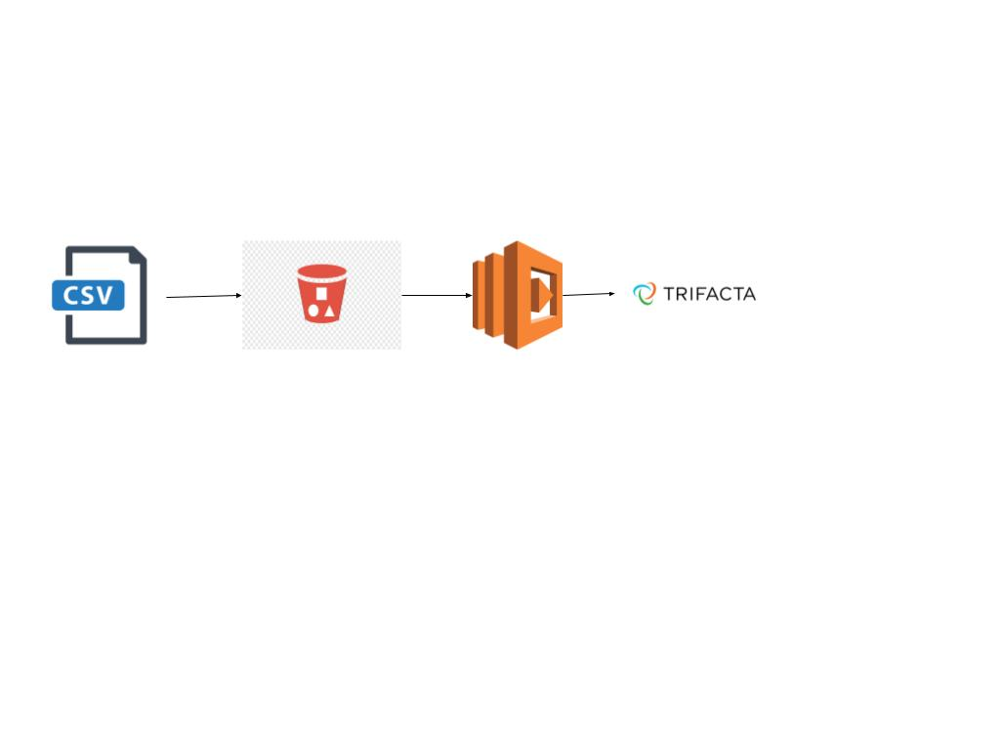
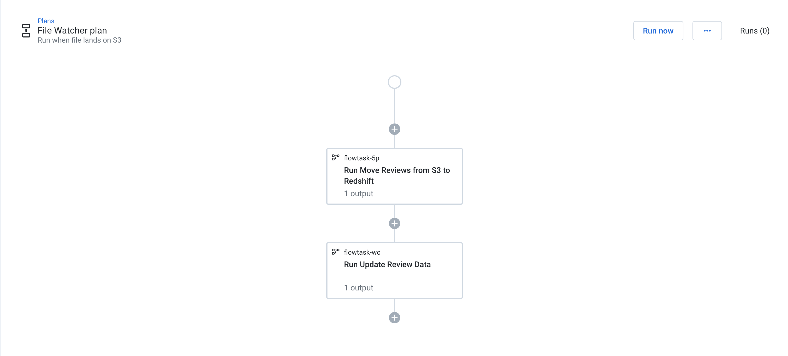

# demo-trigger-trifacta-plan-from-s3

In this example, whenever a file with reviews lands on S3, the plan will be triggered using the API and passing the parameter for the date.
The Flows that are part of Plan, will prep the data and finally insert new Review score in the data warehouse (redshift in the example)

A Sample plan to do this kind of work is shown here

All Trifacta API https://api.trifacta.com/
